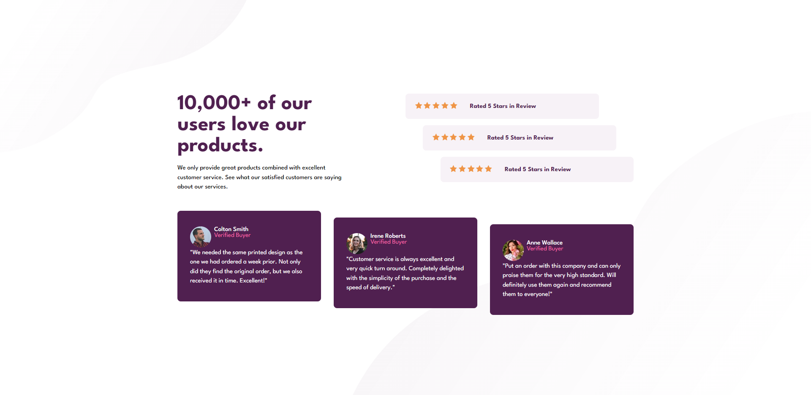

# Social Proof Section


## Visão Geral

### Projeto de uma página estática de prova social de produtos de uma empresa fictícia.
#




#
## Construido com:
- HTML
- CSS
  - Flexbox layout

## Funcionalidades
- Página estática de porva social de produtos de uma empresa fictícia.

## O que eu aprendi:
- Uso de HTML semântico
- Uso de variáveis no CSS
```css
:root {
  --Very_Dark_Magenta: hsl(300, 43%, 22%);
  --Soft_Pink: hsl(333, 80%, 67%);
  --Dark_Grayish_Magenta: hsl(303, 10%, 53%);
  --Light_Grayish_Magenta: hsl(300, 24%, 96%);
  --White: hsl(0, 0%, 100%);
}
```
- Uso de media queries para responsividade em telas mobile.
```css
  @media screen and (min-width: 376px){

  }
```

## Link

Veja o projeto aqui: [Acessar🌍](https://devhiderlan.github.io/social-proof-section-master/)

## Autor

Hiderlan Santana: [Linkedin](https://www.linkedin.com/in/hiderlan-santana/)